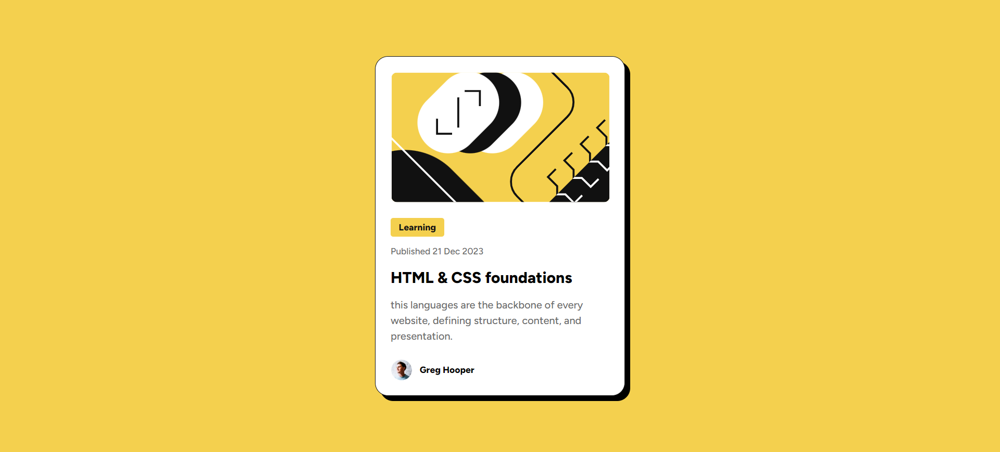
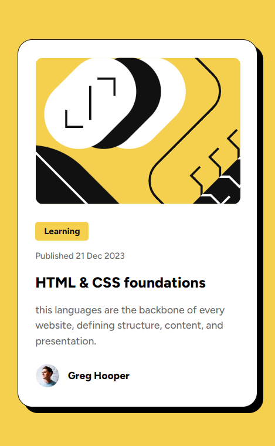

# Frontend Mentor - Blog preview card solution

This is a solution to the [Blog preview card challenge on Frontend Mentor](https://www.frontendmentor.io/challenges/blog-preview-card-ckPaj01IcS). Frontend Mentor challenges help you improve your coding skills by building realistic projects. 

## Table of contents

- [Overview](#overview)
  - [The challenge](#the-challenge)
  - [Screenshot](#screenshot)
  - [Links](#links)
- [My process](#my-process)
  - [Built with](#built-with)
  - [What I learned](#what-i-learned)
  - [Continued development](#continued-development)
  - [Useful resources](#useful-resources)
- [Author](#author)
- [Acknowledgments](#acknowledgments)

**Note: Delete this note and update the table of contents based on what sections you keep.**

## Overview

### The challenge

Users should be able to:

- See hover and focus states for all interactive elements on the page

### Screenshot
Here is a screenshot of the final result.

width - 1440px

width - 375px

## Links

- Solution URL: [Blog Preview Card -GitHub](https://github.com/Nakhaa/blog-preview-card.git)
- Live Site URL: [Blog Preview Card](https://nakhaa.github.io/blog-preview-card/)

## My process

### Built with

- HTML5
- CSS
- Flexbox

### What I learned

I learned to use Figma to be able to create a web that is appropriate and precise like the design.
I also learned to apply the concept of responsive design to this application. 
Although it is difficult, I am very excited to be able to master the concept

### Continued development

I hope to learn more about responsive design and figma. 

## Author

- Frontend Mentor - [@Nakhaa](https://www.frontendmentor.io/profile/nakhaa)
- Instagram - [@m_nakhaa](https://www.instagram.com/m_nakhaa)